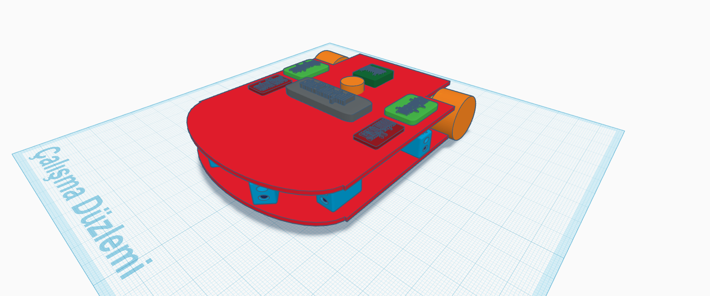
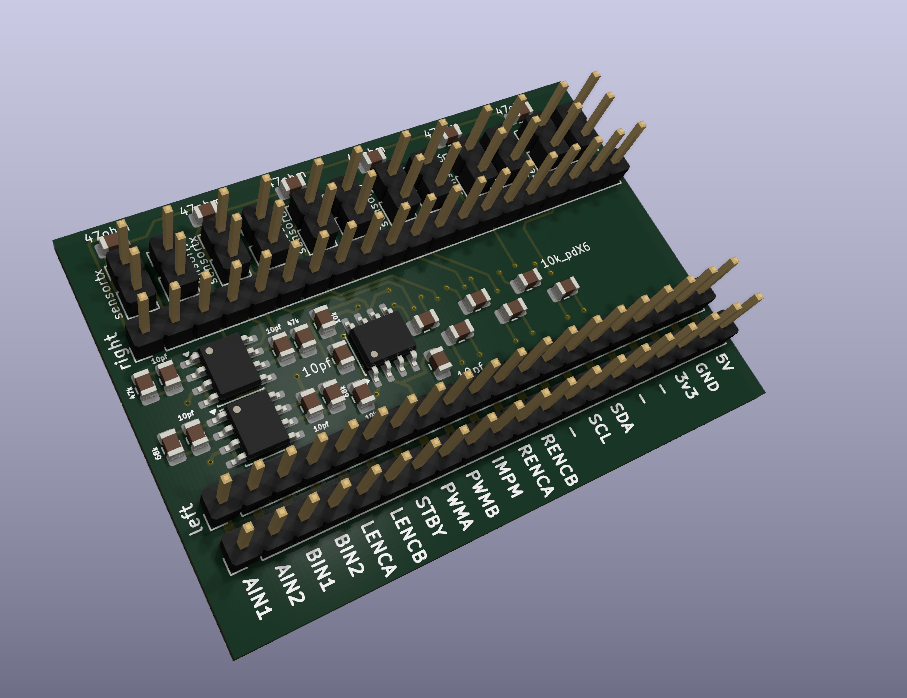
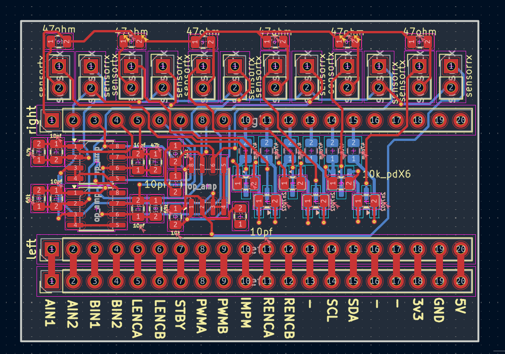

# Micromouse - Autonomous Maze Solving Robot

An autonomous Micromouse robot that is  capable of navigating and solving a maze with high speed and efficiency with custom 3D-printed suction components.

---

## Motivation & Project Goal
I am an 11th-grade student at a Turkish high school with interests in robotics and PCB design. I created this project over the course of the past three months to test my knowledge of control systems, algorithms, and my own custom hardware design capabilities. My goal is to design and make a high-performance Micromouse robot that is capable of competing against the fastest Maze Solving Robots with the help of suction assistance, and optimized algorithms.
---

## Features & Technical Overview
Autonomous Navigation: Implemented the Floodfill Algorithm for calculating the shortest maze path
Closed-Loop Control: PID control with motor encoders and 6-axis gyroscope for precise wall centering and 90-degree turns.
Custom Sensing: Integrated 6 custom IR sensor modules for distance calculation and wall tracking(check kicad file)
Aerodynamic Suction: Custom 3D-printed impeller and mount (designed in Fusion 360) to create additional downforce
Brain: STM32 Blackpill Microcontroller for sensor data acquisition and motor control
---

## Hardware & PCB Design

The image below shows the layout of the custom PCB designed in KiCad:
(it was so hard to do those since it was my first time lol)
---

## Repository Structure
`/cad` contains all STL files (chassis, impeller, and motor mounts)
`/pcb` contains the KiCad schematic and PCB board file such as png and .kicad files.
`/firmware` contains the STM32 source-code for PID motor control, IR sensing and the Floodfill algorithm(read down there)
---

## Bill of Materials (BOM)
[BOM.csv](bom/BOM.csv) - The main BOM file
[BOM.csv](bom/BOM_ozdisan.csv)  - The BOM file for the custom IR sensor
[BOM.csv](bom/BOM_ozdisan.pdf)  - The pdf version of the IR sensor file.(downloaded from the website, its raw and half turkish.)

## /firmware folder
the code uses the STM32 library on ArduınoIDE to code the blackpill board using arduino IDE. heres the link of the library so you can download it too:
https://github.com/stm32duino/BoardManagerFiles/raw/main/package_stmicroelectronics_index.json
also, dont forget that thisa was just  a test code and NOT  the actual code since this is still in the design.
---

thanks for reading, i think thats all i can do, i would be really happy if you approve it- also nothing here is AI Generated, i used AI just fore research and did everything myself i think. :) see you!!
